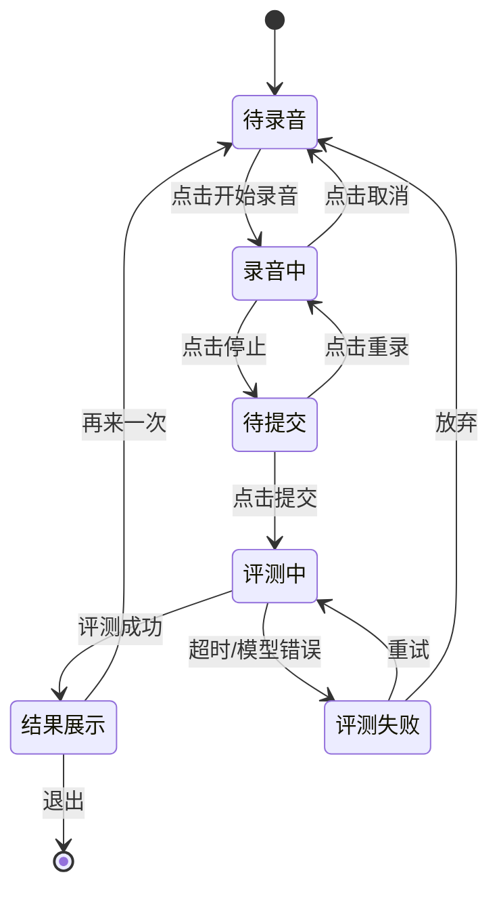

# PRD 深度写作指南

本文档提供PRD各核心章节的深度写作模式，帮助产出"开发读完就能动手"级别的PRD。每个章节提供：写作模式、深度标准、反面教材检查、领域特化指引。

---

## 写作心法

PRD的本质是一份**规格说明书**，不是散文，不是讨论稿，不是PPT。它的读者是开发、测试、设计——他们需要的是：
1. **确定性**：告诉我要做什么，不要说"可以考虑"
2. **完整性**：告诉我所有的情况，不要让我猜
3. **可验证性**：告诉我怎么算做完了，不要让我自己定义

写PRD时，脑子里始终有一个虚拟的后端开发在读你的文档，每遇到一个模糊点他就会举手问："这里具体是什么意思？"你的目标是让他从头读到尾不需要举手。

---

## 章节一：需求背景

### 写作模式

需求背景回答一个核心问题：**为什么要做这个功能？**

好的需求背景由三层构成：
1. **现状**（数据支撑）：当前是什么情况，有什么数据证明？
2. **问题**（痛点定义）：用户遇到了什么具体问题？业务受到什么影响？
3. **机会**（价值论证）：做了之后有什么价值？竞品是什么情况？

### 深度标准

- ✅ 有至少一个具体的数据点（用户调研数据、业务数据、行业数据均可）
- ✅ 痛点描述具体到可感知的场景，而非抽象的"用户体验不好"
- ✅ 提到了竞品现状或市场机会
- ❌ 反面教材：只有一句"用户需要XX功能"

### 示例

**AI口语评测 — 需求背景：**

> **现状**：OneOneTalk当前核心功能为AI实时口语对练，用户日均发起对话3.2次（N=5000 DAU）。但对话结束后用户无法获得口语水平的量化反馈——不知道自己的发音准不准、语法对不对、和上次比有没有进步。
>
> **问题**：用户调研（2026年1月，N=200）显示78%的学习者将"不知道自己说得好不好"列为最大痛点。这直接导致学习动力衰减——我们的7日留存仅15%，用户反馈"练了不知道有没有用"。
>
> **机会**：竞品流利说（DAU 150万+）已有成熟的发音评测体系，ELSA Speak以AI语音评测为核心卖点（融资$27M）。口语评测是AI语言学习产品的核心差异化能力。补齐评测能力预期可将7日留存提升至25%+。

### 没有数据怎么办？

如果用户没有提供具体数据，用以下方式补充：
- 使用 web search 搜索行业报告数据作为参考
- 用合理估算并标注"[预估数据，待验证]"
- 用定性描述替代，但要具体："用户反馈集中反映XX问题"而非"用户有需求"

---

## 章节二：用户场景

### 写作模式

用户场景是**带有时间线的叙事**，描述一个具体用户在具体时间、地点、心理状态下如何使用产品。它的目的是让开发和设计产生共情，理解"我们在为谁做什么"。

用户场景的5W结构：
1. **Who**：具体的人物画像（姓名、身份、特征）
2. **When/Where**：使用场景（时间、地点、设备）
3. **What**：用户的目标和操作步骤
4. **Flow**：系统的响应和交互流程
5. **Result**：最终用户得到什么结果

### 深度标准

- ✅ 每个核心功能至少2个场景（正常场景+边缘/异常场景）
- ✅ 场景中的操作步骤足够具体，能直接映射到UI交互
- ✅ 包含系统的响应行为，不只有用户动作
- ❌ 反面教材："用户可以使用XX功能"

### 示例

**AI口语评测 — 用户场景：**

> **场景1：高中生晚自习后练习（正常流程）**
> 
> 小明是高二学生，每天晚自习9点结束后用手机练习英语口语。他打开OneOneTalk，进入"口语评测"模块，看到三种评测模式：跟读评测、话题回答、情景对话。他选择"跟读评测"，系统随机出一段BBC新闻朗读材料（约30词），页面展示英文文本+参考音频播放按钮。
> 
> 小明点击"开始录音"，页面底部出现实时音频波形。他朗读完成后点击"提交评测"，页面显示分析动画（约1.5秒），然后展示评测结果卡片：综合分82分，其中发音准确度85分、语调自然度78分、流畅度83分。"th"和"r"发音被标红，点击可听到标准发音对比。底部展示"本周进步+5分"的趋势图。
>
> **场景2：弱网环境下的降级体验（异常流程）**
>
> 小红在地铁上使用，网络信号不稳定（4G频繁切3G）。她录完音频点击提交后，系统尝试上传但网络超时（>5秒）。页面提示"网络不给力，音频已保存到本地，网络恢复后自动提交评测"。到站后WiFi连接，系统自动完成评测并推送通知"你的评测结果出来了：综合分79分"。

### 场景数量建议

| 功能复杂度 | 正常场景 | 异常/边缘场景 | 总计 |
|-----------|---------|-------------|------|
| 小功能 | 1 | 0-1 | 1-2 |
| 中等功能 | 2-3 | 1-2 | 3-5 |
| 大功能 | 3-5 | 2-3 | 5-8 |

---

## 章节三：功能需求

### 写作模式

功能需求是PRD的核心。每个功能点要用**IPO模式**描述：

- **Input**：什么触发了这个功能？用户做了什么操作？输入数据是什么格式？
- **Process**：系统内部做了什么处理？业务逻辑是什么？有什么规则？
- **Output**：系统返回了什么？页面展示了什么？状态如何变化？
- **Exception**：出错了怎么办？边界条件如何处理？

### 深度标准

- ✅ 每个功能点都有Input/Process/Output/Exception
- ✅ 关键业务规则用表格或条件列表明确描述
- ✅ 状态流转关系清晰（可用Mermaid状态图）
- ✅ 数据格式和范围有明确定义
- ❌ 反面教材：只有功能名称+一句话描述

### 示例

**发音评测功能 — 功能需求：**

> **3.1 发音评测**
>
> **Input**：
> - 触发方式：用户在评测页点击"提交评测"按钮
> - 输入数据：音频文件（WebM/Opus格式，采样率16kHz，单声道，时长5-60秒）
> - 附带数据：评测材料ID、语种标识（en/zh）、用户等级
>
> **Process**：
> 1. 客户端将音频转码为16kHz PCM格式
> 2. 通过HTTPS上传至评测服务（最大文件5MB，超时10秒）
> 3. 评测服务调用语音评测模型，返回多维度评分
> 4. 评分结果写入用户评测记录表，更新统计数据
>
> **Output**：
> - 综合评分：0-100整数，= 发音×0.4 + 语调×0.3 + 流畅度×0.3（权重后台可配置）
> - 维度评分：发音准确度(0-100)、语调自然度(0-100)、流畅度(0-100)
> - 薄弱点标注：返回具体单词级的错误标注（单词index + 错误类型 + 纠正建议）
> - 历史趋势：最近7次评测的分数变化折线数据
>
> **Exception**：
> | 异常场景 | 系统行为 | 用户提示 |
> |---------|---------|---------|
> | 音频时长<5秒 | 客户端拦截，不上传 | "录音时间太短，请至少朗读5秒" |
> | 音频时长>60秒 | 客户端截取前60秒上传 | "已截取前60秒进行评测" |
> | 上传超时（>10秒）| 本地缓存音频，网络恢复后重试 | "网络不给力，稍后自动重试" |
> | 模型评测失败 | 重试1次，仍失败则返回错误 | "评测服务暂时繁忙，请稍后重试" |
> | 环境噪音过大（SNR<10dB）| 客户端检测后提醒 | "环境较吵，建议到安静处再录音" |

### 状态图（复杂流程推荐使用）

对于有多状态的功能，用Mermaid画状态流转图：

---

## 章节四：非功能需求

### 写作模式

非功能需求不是通用性能指标（"要快"、"要稳"），而是**该产品场景下的具体技术约束**。

### 领域特化写法

**AI/大模型产品**：
- 模型推理延迟预算：端到端（用户感知）≤ X秒，其中网络传输≤Y ms，模型推理≤Z ms
- Token成本预算：单次请求平均X tokens，日均请求Y次，月成本≤Z元
- 准确率/召回率目标：评测准确率≥X%（基准：人工评测一致性）
- 降级策略：模型不可用时如何处理（缓存结果/简化评测/关闭功能）

**实时通信产品**：
- 端到端延迟：语音≤200ms（ITU-T G.114标准），视频≤400ms
- 连接建立时间：首次连接≤3秒，重连≤1秒
- 弱网表现：丢包5%时音质可接受，丢包20%时自动降码率
- 并发设计：支持X个并发连接/服务器实例

**教育产品**：
- 学习数据同步：多端数据同步延迟≤5秒
- 离线支持：核心学习内容支持离线使用
- 内容安全：所有AI生成内容需过敏感词过滤

### 深度标准

- ✅ 性能指标有具体数值和测量方法（P95/P99而非平均值）
- ✅ 指标与业务场景关联（为什么是200ms不是500ms）
- ✅ 包含降级和容错策略
- ❌ 反面教材："性能要好"、"要快"、"高可用"

---

## 章节五：验收标准

### 写作模式

验收标准 = QA的测试用例种子。用**Given-When-Then**模式或**AC编号**模式。

### 深度标准

- ✅ 每个功能至少3条可验证的AC
- ✅ AC包含具体数值（时间、数量、百分比）
- ✅ 覆盖正常和异常路径
- ✅ 可以直接转写为自动化测试用例
- ❌ 反面教材："功能正常可用"、"用户体验良好"

### 示例

> **发音评测验收标准：**
>
> - AC1：用户完成跟读后提交评测，P95延迟≤2秒展示评测结果
> - AC2：评测结果包含综合分+3个维度分，均为0-100整数
> - AC3：评测结果中错误单词标注与人工标注一致性≥85%（取样100句）
> - AC4：弱网环境（模拟3G，丢包5%）下评测完成率≥90%
> - AC5：音频录制支持实时波形展示，帧率≥24fps，延迟≤100ms
> - AC6：连续评测10次不出现内存泄漏（页面内存增量<20MB）
> - AC7：评测记录同步到"学习报告"页面，延迟≤5秒

---

## 章节六：数据埋点

### 写作模式

每个关键用户行为都需要一个埋点事件。用表格格式，确保开发不遗漏。

### 深度标准

- ✅ 覆盖核心转化路径的每个节点
- ✅ 事件名称规范统一（推荐 object_action 格式）
- ✅ 字段定义完整（字段名、类型、取值范围、是否必填）
- ❌ 反面教材："需要埋点"、只写了事件名没写字段

### 示例

> | 事件名称 | 触发时机 | 关键字段 | 分析目的 |
> |---------|---------|---------|---------|
> | assessment_start | 用户点击"开始录音" | user_id, mode(跟读/话题/对话), material_id, language | 评测功能使用率 |
> | assessment_submit | 用户提交评测 | user_id, audio_duration_sec, file_size_kb | 完成率分析 |
> | assessment_result | 评测结果返回 | user_id, overall_score, latency_ms, dimension_scores(JSON) | 评测质量+性能监控 |
> | assessment_retry | 用户点击重试 | user_id, retry_reason(timeout/error/voluntary) | 失败率追踪 |
> | assessment_share | 用户分享评测结果 | user_id, share_channel(wechat/screenshot/link) | 传播分析 |

---

## 竞品分析写法

### 原则

竞品分析不是列一堆竞品名称+"优势/劣势"的空表格。好的竞品分析要：
1. 选择2-3个最直接的竞品（不要列10个凑数）
2. 深入分析它们的具体产品设计（截图、流程、评分体系）
3. 提炼可借鉴的点和差异化空间

### 操作方法

- **必须** 使用 web search 搜索竞品的最新功能和用户评价
- 如果可能，亲自体验竞品并记录关键交互流程
- 竞品对比维度要针对当前功能场景（不要用通用的"界面/功能/价格"）

### 示例维度（口语评测场景）

| 维度 | OneOneTalk（本产品） | 流利说 | ELSA Speak |
|------|-------------------|-------|-----------|
| 评测维度 | 发音+语调+流畅度 | 发音+语调+流畅度+完整度 | 发音+重音+语调+流畅度 |
| 评分精度 | 单词级 | 音素级 | 音素级 |
| 反馈方式 | 分数+文字建议 | 分数+示范音频+口型动画 | 分数+波形对比+发音图谱 |
| 离线支持 | 不支持（V1） | 支持 | 部分支持 |
| 语种支持 | 中/英 | 中/英 | 英语为主 |

---

## PRD反面教材检查清单

写完PRD后，搜索以下字样。如果出现，说明该处需要加深度：

- [ ] "用户可以XX" → 改为具体的交互流程
- [ ] "系统支持XX" → 改为功能的IPO描述
- [ ] "性能要好/要快" → 改为具体数值
- [ ] "使用AI实现" → 改为模型选型+参数+成本分析
- [ ] "参考竞品" → 改为具体竞品名称+功能对比
- [ ] 连续3行以上没有具体数字 → 尝试补充量化数据
- [ ] "[待补充]"超过3处 → 主动搜索或做合理估算
- [ ] 整个功能描述<5行 → 大概率深度不够
